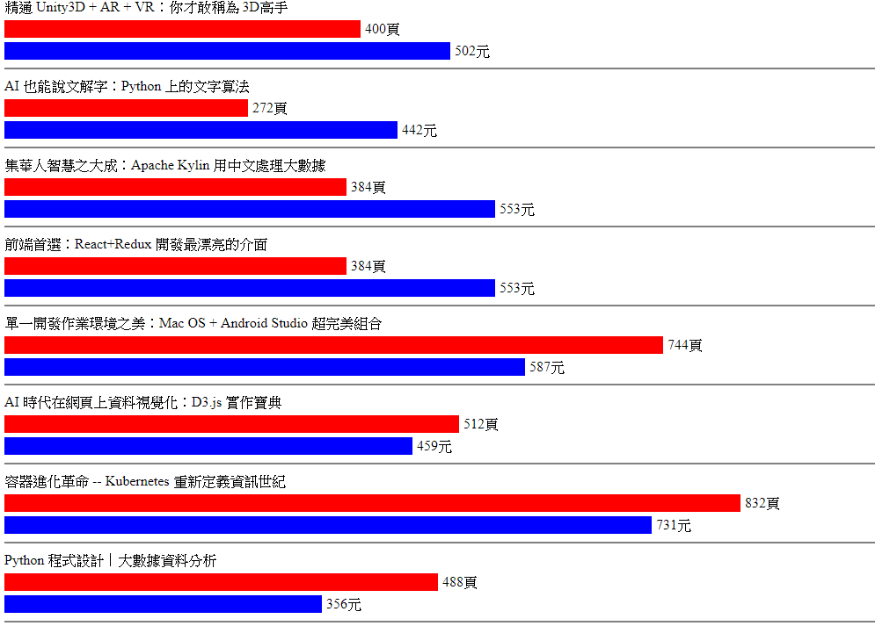

# 繪製橫條圖

## 執行結果


```javascript
d3.json('data/json/books.json').then(pages => {
    var n = 0;
    pages.forEach(books => {
        for (title in books) {
            //當前的書
            let book = books[title];

            //繪製標題(書名)
            d3.select('svg')
                .append('text')
                .attr('x', 10)
                .attr('y', 20 + 90 * n)
                .text(title);

            //繪製頁數的矩形
            d3.select('svg')
                .append('rect')
                .attr('x', 10)
                .attr('y', 30 + 90 * n)
                .attr('fill', 'red')
                .attr('width', parseInt((book['頁數:'] || [0])[0]) + 5)
                .attr('height', 20);

            //繪製頁數的文字
            d3.select('svg')
                .append('text')
                .attr('x', 15 + parseInt((book['頁數:'] || [0])[0]) + 5)
                .attr('y', 45 + 90 * n)
                .text((book['頁數:'] || ['未知'])[0] + '頁');

            //繪製售價的矩形
            d3.select('svg')
                .append('rect')
                .attr('x', 10)
                .attr('y', 55 + 90 * n)
                .attr('fill', 'blue')
                .attr('width', parseInt((book['售價:'] || [0, '00'])[1].substr(1)
                    .replace(',', '')) + 5)
                .attr('height', 20);

            //繪製售價的文字
            d3.select('svg')
                .append('text')
                .attr('x', 15 + parseInt((book['售價:'] || [0, '00'])[1].substr(1)
                    .replace(',', '')) + 5)
                .attr('y', 70 + 90 * n)
                .text((book['售價:'] || [0, '0未知'])[1].substr(1) + '元');

            //設定SVG畫布的高度
            d3.select('svg')
                .attr('height', 55 + 90 * n + 20);

            //繪製每本書的分隔線
            d3.select('svg')
                .append('line')
                .attr('x1', 10)
                .attr('y1', 75 + 90 * n + 10)
                .attr('x2', 1000)
                .attr('y2', 75 + 90 * n + 10)
                .attr('stroke', 'black');

            n++;
        }
    });
});
```